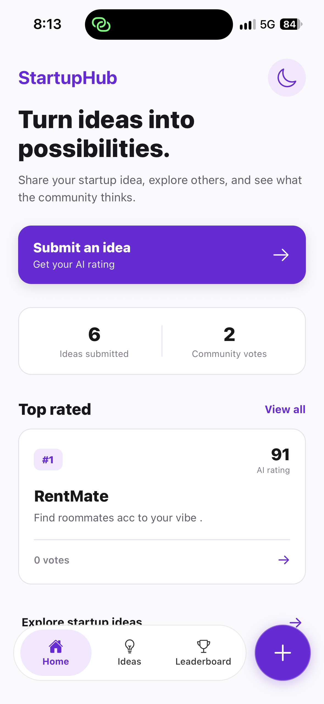
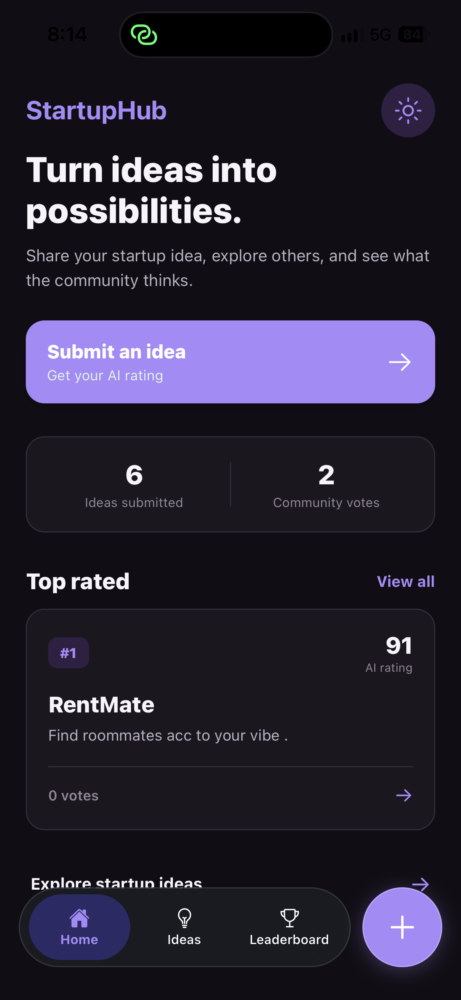
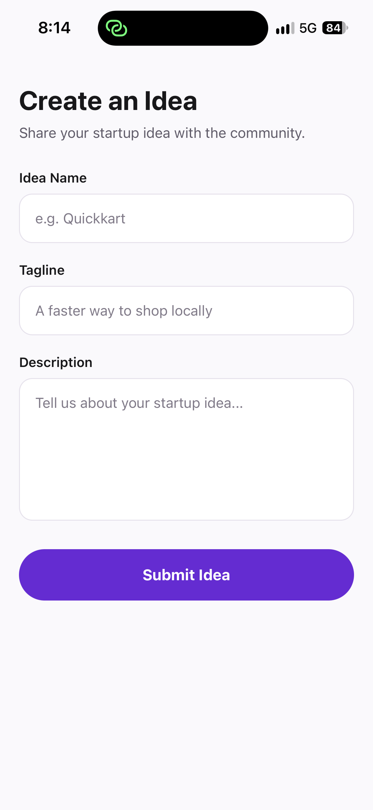
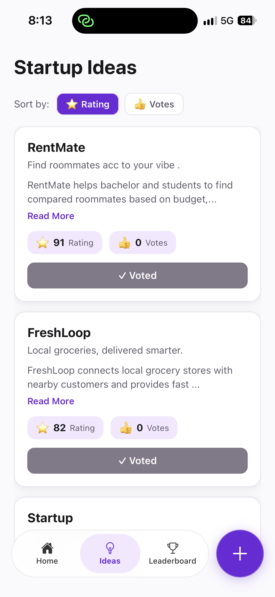
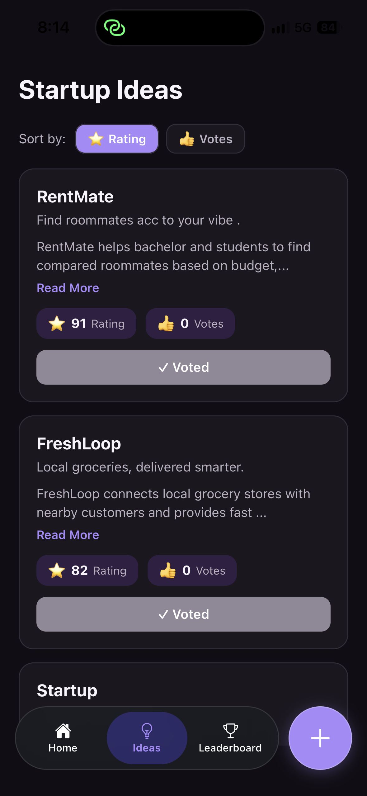
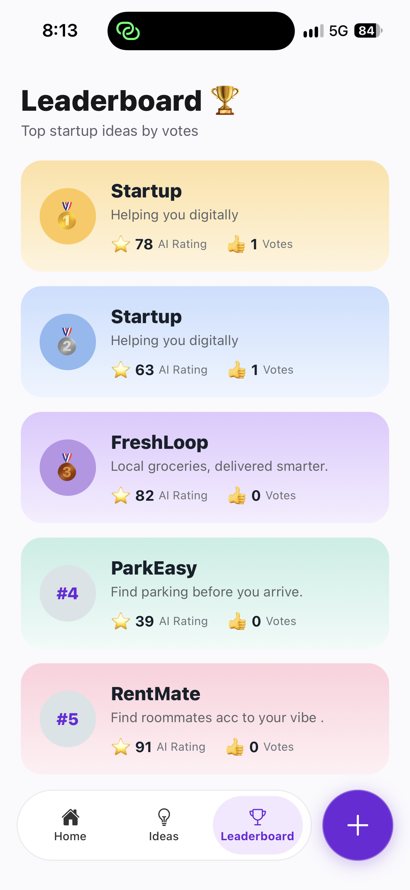

# 🚀 Startup Idea Evaluator

A React Native mobile application where users can submit startup ideas, receive a simulated AI rating, explore ideas from the community, vote on them, and view a leaderboard of the most-voted ideas.

Built as part of the **PGAGI SDE Intern – Mobile Application Assignment**.

---

## 📱 Overview

Startup Idea Evaluator follows a simple flow:

**Submit an idea → Get an AI rating → Explore ideas → Vote → View the leaderboard**

The application demonstrates:

- React Native development
- TypeScript
- Redux Toolkit state management
- Local data persistence
- React Navigation
- Theme management
- Component-based UI development
- User interaction and local voting logic

---

## ✨ Features

### 💡 Submit Startup Ideas

Users can submit a startup idea with:

- Idea name
- Tagline
- Description

The form includes validation to ensure the required fields are completed.

### 🤖 Simulated AI Rating

When an idea is submitted, the application generates a simulated rating between **0 and 100**.

The rating is generated once during submission and stored with the idea, so it does not change when the application re-renders or restarts.

### 📋 Explore Startup Ideas

Users can browse all submitted startup ideas.

Each idea displays:

- Startup name
- Tagline
- Description
- AI rating
- Vote count

### 👍 Community Voting

Users can upvote startup ideas.

The application prevents the same device from voting for the same idea more than once.

Vote history is stored locally using AsyncStorage.

> **Note:** Since this implementation uses local storage rather than a backend voting system, the one-vote restriction is device-level rather than server-side.

### 📖 Read More

Long descriptions can be expanded and collapsed using:

- Read More
- Show Less

### 🔀 Sorting

Startup ideas can be sorted by:

- ⭐ AI Rating
- 👍 Vote Count

### 🏆 Leaderboard

The leaderboard displays the **top 5 startup ideas based on vote count**.

Each entry includes:

- Rank
- Startup name
- Tagline
- AI rating
- Vote count

The leaderboard uses custom rank badges and gradient cards for visual hierarchy.

### 🌙 Dark Mode

The application supports:

- Light Mode
- Dark Mode

The selected theme is persisted locally, so the user's preference remains after restarting the application.

---

## 🎨 UI / UX

The application includes:

- Floating glass-style bottom navigation
- Separate floating "+" button for submitting ideas
- Light and dark themes
- Theme-aware navigation
- Safe Area handling
- Custom leaderboard cards
- Rank badges
- Gradient cards
- Empty states
- Interactive sorting controls
- Expandable descriptions
- Visual feedback for voted ideas
- Consistent spacing and typography

The visual design uses a blue/indigo color palette to represent technology, creativity, and innovation.

---

## 🛠️ Tech Stack

| Technology                     | Purpose                            |
| ------------------------------ | ---------------------------------- |
| React Native                   | Mobile application framework       |
| Expo                           | Development and build environment  |
| TypeScript                     | Type safety                        |
| Redux Toolkit                  | Global state management            |
| React Redux                    | Connecting Redux with React Native |
| React Navigation               | Application navigation             |
| AsyncStorage                   | Local data persistence             |
| Expo Blur                      | Glass-style UI effects             |
| Expo Linear Gradient           | Gradient UI elements               |
| Expo Vector Icons              | Icons                              |
| React Native Safe Area Context | Safe area handling                 |

---

## 🏗️ Project Structure

```text
StartupIdeas/
│
├── App.tsx
├── package.json
├── package-lock.json
├── .gitignore
├── README.md
│
└── src/
    │
    ├── components/
    │   └── FloatingBottomBar.tsx
    │
    ├── navigation/
    │   ├── RootNavigator.tsx
    │   └── MainTabNavigator.tsx
    │
    ├── screens/
    │   ├── HomeScreen.tsx
    │   ├── IdeasListScreen.tsx
    │   ├── LeaderboardScreen.tsx
    │   └── SubmitIdeaScreen.tsx
    │
    ├── store/
    │   ├── slices/
    │   │   ├── ideaSlice.ts
    │   │   └── themeSlice.ts
    │   ├── hooks.ts
    │   └── index.ts
    │
    ├── theme/
    │   ├── theme.ts
    │   └── useAppTheme.ts
    │
    ├── types/
    │   └── idea.ts
    │
    └── utils/
        ├── generateRating.ts
        ├── storage.ts
        └── voteStorage.ts


 ## 📸 Screenshots

### 🏠 Home – Light Mode



### 🌙 Home – Dark Mode



### 💡 Create Idea



### 📋 Ideas – Light Mode



### 🌙 Ideas – Dark Mode



### 🏆 Leaderboard


```
